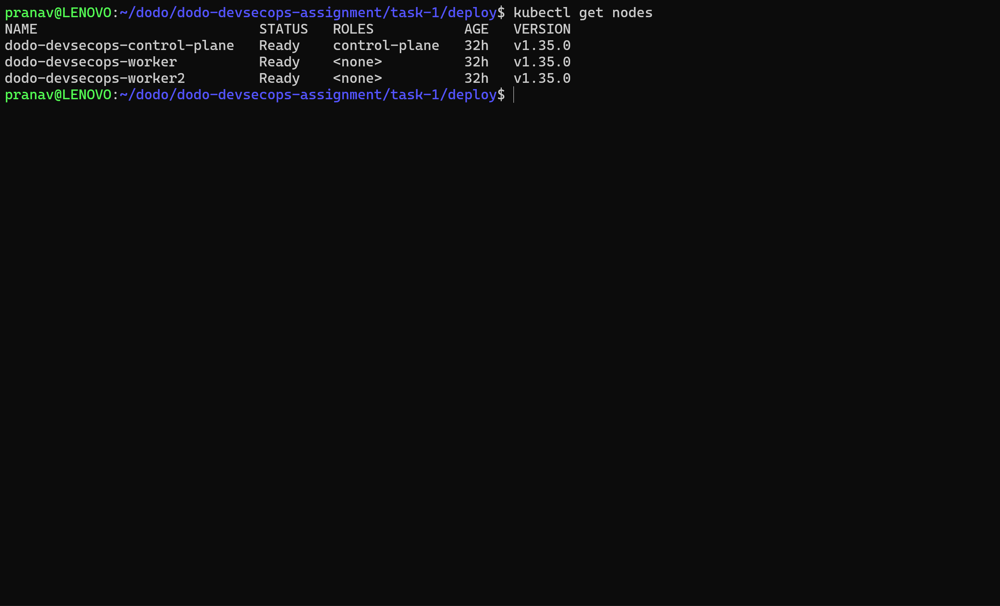
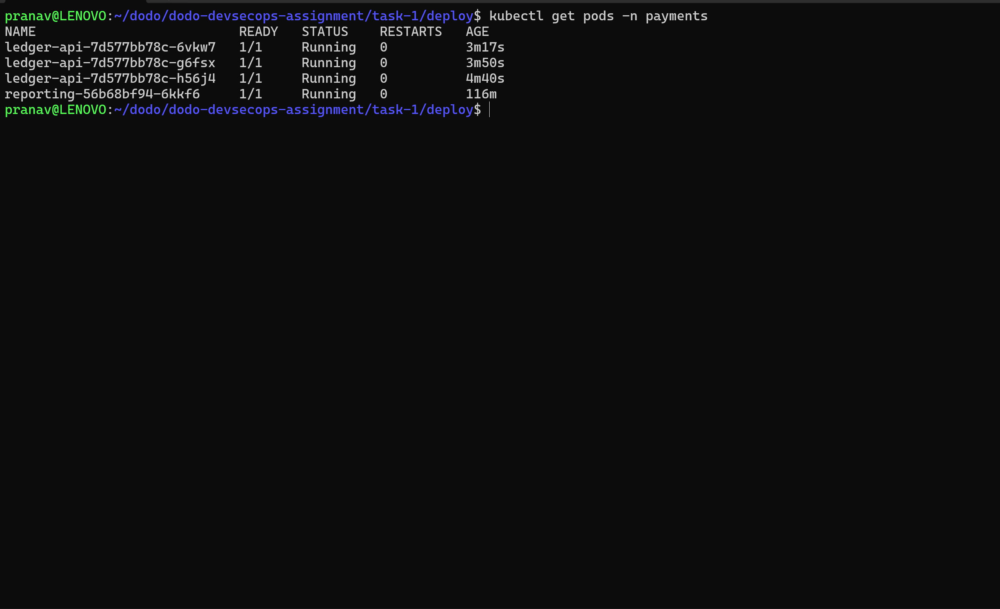
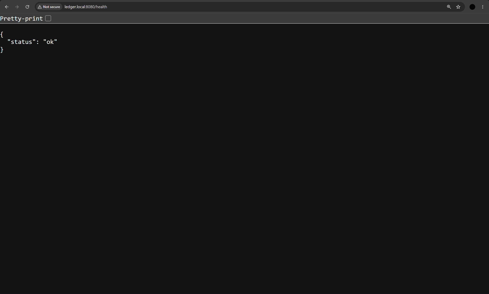
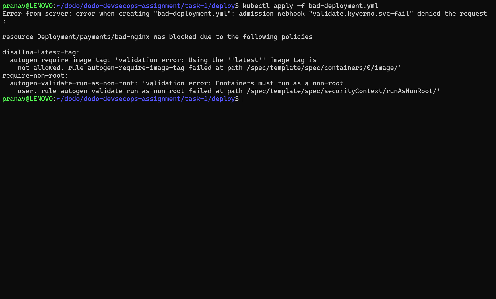
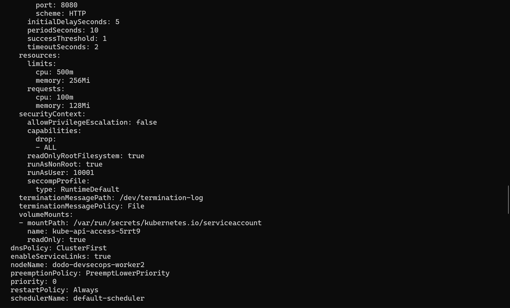
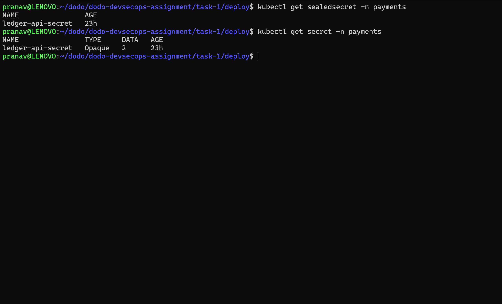
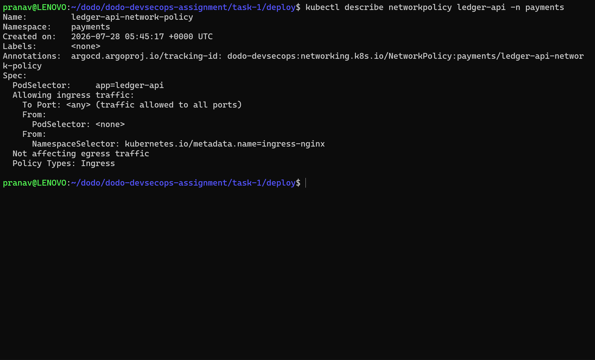

# Task 1 — Deploy & Harden the Workload

Deploys `ledger-api` plus a `reporting` neighbour service into a dedicated `payments`
namespace on a local 3-node `kind` cluster, locked down end to end.

## What's in this folder

```
task-1/
├── kind-config.yml                 # 1 control-plane + 2 worker nodes, k8s v1.35.0
└── deploy/
    ├── namespace.yaml               # `payments` namespace
    ├── configmap.yml                # Non-secret config: APP_ENV, LOG_LEVEL, ALLOWED_HOSTS
    ├── secret.yml                   # SealedSecret (Bitnami Sealed Secrets) — DB_PASSWORD, STRIPE_API_KEY
    ├── service-account.yml          # Dedicated `ledger-api` ServiceAccount
    ├── role.yml                     # Role: get/list/watch on pods
    ├── rolebinding.yml              # Binds the Role to the ledger-api ServiceAccount
    ├── deployment.yaml              # ledger-api Deployment, 3 replicas, hardened securityContext
    ├── neighbour.yaml               # `reporting` Deployment (curl client) + its own ServiceAccount
    ├── service.yaml                 # ClusterIP Service, port 8080
    ├── ingress.yml                  # nginx Ingress, host `ledger.local`
    ├── networkpolicy.yml            # Ingress policy: allow same-namespace pods + ingress-nginx
    └── policies/
        ├── require-non-root.yml     # Kyverno: enforce pod-level runAsNonRoot: true
        └── disallow-latest.yml      # Kyverno: block any container using the `:latest` tag
```

## Cluster setup

```bash
kind create cluster --config kind-config.yml
```

3-node cluster (`kindest/node:v1.35.0`): 1 control-plane, 2 workers. The control-plane
maps container port `30080` → host port `8080` for local access.

### kind Cluster

The application is deployed on a local three-node kind cluster consisting of one control-plane node and two worker nodes.




## Deploy

```bash
kubectl apply -f deploy/namespace.yaml
kubectl apply -f deploy/service-account.yml
kubectl apply -f deploy/role.yml
kubectl apply -f deploy/rolebinding.yml
kubectl apply -f deploy/secret.yml       # requires the Sealed Secrets controller installed first
kubectl apply -f deploy/configmap.yml
kubectl apply -f deploy/deployment.yaml
kubectl apply -f deploy/neighbour.yaml
kubectl apply -f deploy/service.yaml
kubectl apply -f deploy/ingress.yml       # requires an ingress-nginx controller installed
kubectl apply -f deploy/networkpolicy.yml

```
### Deployment Successful




### Application Health Check

The application is accessible through the configured Ingress and responds successfully on the health endpoint.



## Guardrails (Kyverno)

```bash
kubectl apply -f deploy/policies/require-non-root.yml
kubectl apply -f deploy/policies/disallow-latest.yml
```

| Policy | Enforces |
|---|---|
| `require-non-root.yml` | `Enforce` mode — rejects any Pod without `spec.securityContext.runAsNonRoot: true` (excludes `ingress-nginx`, `kube-system`, `argocd` namespaces) |
| `disallow-latest-tag` (`disallow-latest.yml`) | `Enforce` mode — rejects any Pod with a container image ending in `:latest` |

### Kyverno Policy Enforcement

The following screenshot demonstrates Kyverno rejecting an insecure deployment that violates the enforced admission policies.




## Hardening decisions

### Container security context (`deployment.yaml`)
- Pod-level `runAsNonRoot: true`; container-level `runAsUser: 10001` (matches the
  non-root `app` user baked into the Docker image)
- `allowPrivilegeEscalation: false`
- `readOnlyRootFilesystem: true`
- `capabilities.drop: [ALL]`
- `seccompProfile.type: RuntimeDefault`

The `reporting` neighbour (a `curlimages/curl` sidecar-style client used to exercise
`ledger-api`) is hardened the same way — non-root, read-only rootfs, all capabilities
dropped, `seccompProfile: RuntimeDefault`.

### Hardened Security Context

The deployed `ledger-api` pod is running with the configured security controls, including a non-root user, a read-only root filesystem, dropped Linux capabilities, and the RuntimeDefault seccomp profile.



### Resource limits & probes
`ledger-api` requests `100m` CPU / `128Mi` memory, limited to `500m` CPU / `256Mi`
memory. `readinessProbe` and `livenessProbe` both hit `GET /health` (port 8080):
readiness checks every 10s after a 5s initial delay; liveness every 20s after a 15s
initial delay, 3-failure threshold on both.

### RBAC & ServiceAccount
`ledger-api` runs under its own ServiceAccount (`service-account.yml`), not the
namespace `default`. `role.yml` currently grants `get/list/watch` on `pods` — worth
re-checking this against what the app actually calls, since `app.py` doesn't touch
the Kubernetes API anywhere; a tighter role (or no Role at all if unused) would better
match "least-privilege scoped to what it actually needs." `reporting` gets its own
dedicated ServiceAccount too, with no Role bound (no cluster permissions).

### Secrets
`secret.yml` is a Bitnami **Sealed Secret** — `DB_PASSWORD` and `STRIPE_API_KEY` are
stored as ciphertext that only the in-cluster Sealed Secrets controller can decrypt
into a real `Secret`. No plaintext secret ever touches git. Requires the controller
(and its private key) installed on the cluster before this manifest will resolve.

### Sealed Secret Verification

The SealedSecret is successfully decrypted into a Kubernetes Secret by the Sealed Secrets controller inside the cluster.



### Network segmentation
`networkpolicy.yml` is currently **ingress-only** (`policyTypes: [Ingress]`): it
allows traffic into `ledger-api` from other pods in the same namespace and from the
`ingress-nginx` namespace. There's no egress restriction yet, and no default-deny
baseline NetworkPolicy for the namespace — that's a gap to close, and doubles as
useful defense-in-depth groundwork ahead of Task 3's mesh-layer `NetworkPolicy`.

### Network Policy Verification

The NetworkPolicy restricts ingress traffic to the `ledger-api` pods, allowing access only from workloads in the same namespace and the `ingress-nginx` namespace.



## Bonus items

- [ ] RBAC roles for developer / operator / admin personas
- [ ] Pod Security Standards (`restricted`) enforced at the namespace level
- [ ] Demonstrated admission-policy rejection of the original insecure Deployment

Not yet implemented — call out as "what I'd do with more time" if submitting as-is.

## Verifying it works

```bash
kubectl get pods -n payments
kubectl get pod <pod> -n payments -o yaml        # confirm securityContext applied
kubectl auth can-i --list --as=system:serviceaccount:payments:ledger-api
```

