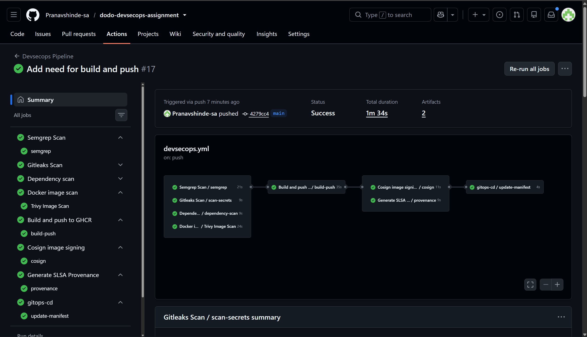
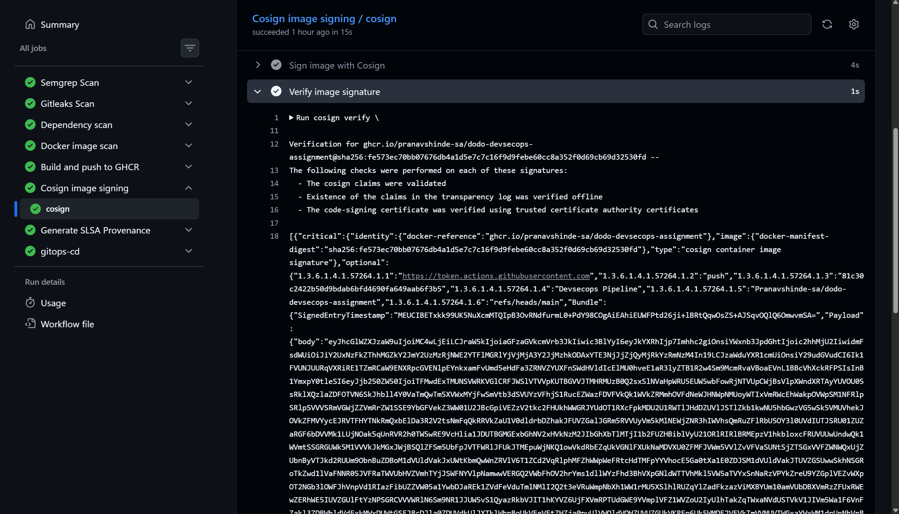
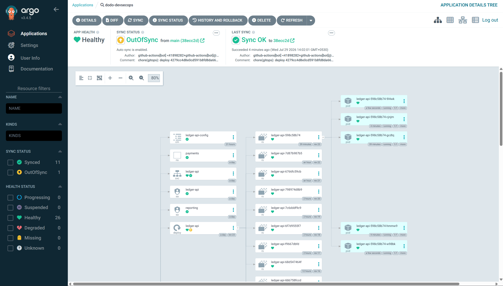
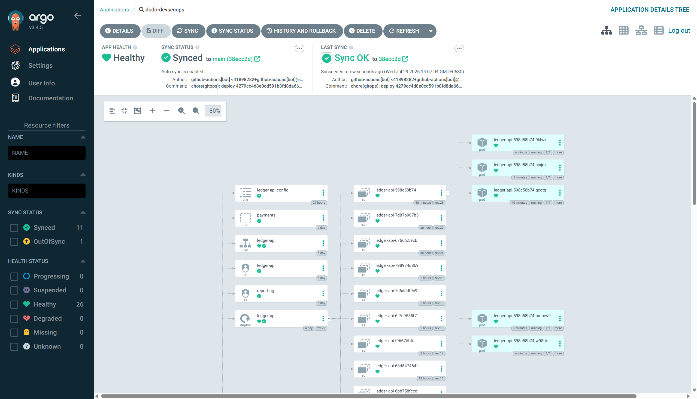
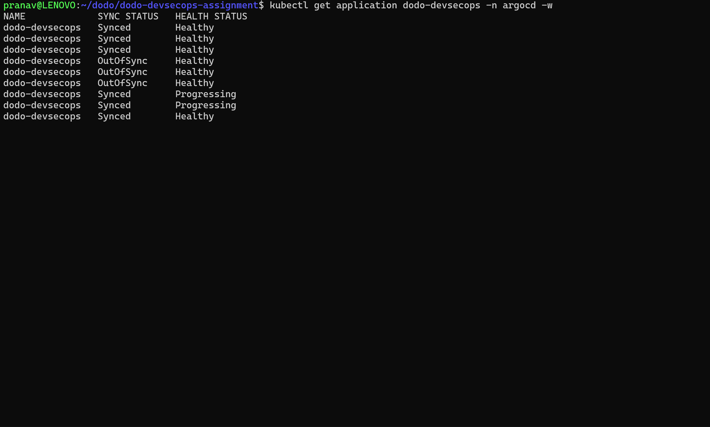

# Task 2 — Secure CI/CD Pipeline & Supply Chain

Security is enforced by the pipeline itself: `devsecops.yml` orchestrates every gate
below, and nothing reaches the cluster without passing all of them.

## What's in this folder

```
task-2/
└── application.yml     # ArgoCD Application — GitOps source of truth
```

The actual pipeline logic lives at the repo root in
[`.github/workflows/`](../.github/workflows):

| Workflow | Purpose |
|---|---|
| `devsecops.yml` | Orchestrator — wires every gate below together on push/PR |
| `semgrep.yml` | SAST |
| `dependency-scan.yml` | Trivy filesystem scan of `requirements.txt` (CVEs) |
| `image-scan.yml` | Trivy scan of the built container image |
| `gitleaks.yml` | Secrets scanning |
| `build-push.yml` | Builds `app/Dockerfile`, pushes to GHCR |
| `cosign.yml` | Keyless Cosign signing + immediate verification |
| `slsa.yml` | SLSA provenance attestation via GitHub's native `attest-build-provenance` |
| `gitops-cd.yml` | Rewrites the image digest in `task-1/deploy/deployment.yaml` and commits |

## Triggers

`devsecops.yml` runs on:
- `push` to `main` or `task2-secure-cicd-supply-chain`
- `pull_request` targeting `main`
- manual `workflow_dispatch`

## Pipeline flow

```
                ┌─ semgrep.yml (SAST)
                ├─ gitleaks.yml (secrets scan)
                ├─ dependency-scan.yml (CVE scan of requirements.txt)
                └─ image-scan.yml (CVE scan of the built image)
                         │  (all four must pass)
                         ▼
                build-push.yml — build app/Dockerfile, push :latest + :<sha> to GHCR
                         │
              ┌──────────┴──────────┐
              ▼                     ▼
        cosign.yml             slsa.yml
     (sign + verify)      (provenance attestation)
              └──────────┬──────────┘
                         ▼
                gitops-cd.yml — commit new image digest to
                task-1/deploy/deployment.yaml on main
```

`image-scan.yml` rebuilds the image locally (`docker build`) rather than pulling the
just-pushed GHCR image, so it runs in parallel with the other three gates, before
`build-push` — all four are prerequisites of `build-push`, not sequential.

## End-to-End Pipeline

The DevSecOps pipeline successfully completed all security gates, built the container image, signed it with Cosign, generated SLSA provenance, and updated the GitOps manifests.


**Pipeline Run:** [GitHub Actions](https://github.com/Pranavshinde-sa/dodo-devsecops-assignment/actions/runs/30439910394)




## Security gates & fail policy

| Gate | Tool | Blocks on |
|---|---|---|
| SAST | Semgrep (`--config auto --error`) | Any finding from the `auto` ruleset fails the job — no severity threshold, everything is a hard block |
| Secrets scan | gitleaks | Any verified finding fails the job |
| Dependency scan | Trivy (`fs`, scanning `.`) | `HIGH`/`CRITICAL` — **no** `ignore-unfixed` flag, so a CVE with no available fix still blocks the build here |
| Image scan | Trivy (image mode) | `HIGH`/`CRITICAL` **with `ignore-unfixed: true`** — a CVE with no fix yet is reported but does not block |

### CVE Handling

The dependency scan fails the pipeline whenever **HIGH** or **CRITICAL** vulnerabilities are detected in the application dependencies.

The image scan is configured with `ignore-unfixed: true`, allowing the pipeline to continue when an operating system package has no upstream fix available while still reporting the vulnerability. This helps avoid blocking deployments on issues that cannot yet be remediated.

### Semgrep Configuration

`.semgrepignore` excludes `task-1/deploy/policies/*.yml` because the Kyverno `ClusterPolicy` manifests are Kubernetes policy definitions rather than application source code.

Two specific `# nosemgrep` suppressions exist in `app/app.py`, both with inline
justification comments:
- the `/fetch` SSRF-shaped request — suppressed because it's mitigated by an
  HTTPS-only check, an `ALLOWED_HOSTS` allowlist, and `allow_redirects=False`
- `app.run(host="0.0.0.0", ...)` — suppressed because exposure is controlled by the
  NetworkPolicy/Ingress layer, not the bind address

## Signing & provenance (Cosign + SLSA)

`cosign.yml` signs the image keylessly (OIDC-based, no static key material) and
verifies it in the same job:

```bash
cosign sign "$IMAGE"
cosign verify \
  --certificate-identity-regexp "https://github.com/${{ github.repository }}/.github/workflows/.*" \
  --certificate-oidc-issuer "https://token.actions.githubusercontent.com" \
  "$IMAGE"
```

The successful verification step demonstrates that the image was signed by this workflow and its signature was validated before deployment.


### Cosign Signing & Verification

The container image is signed using keyless Cosign (GitHub OIDC) and immediately verified within the same workflow before deployment.



`slsa.yml` uses GitHub's native `actions/attest-build-provenance` action to generate
and push a SLSA-style provenance attestation for the image digest — no separate SLSA
generator/verifier tooling required.

## GitOps (ArgoCD)

`application.yml` points ArgoCD at this repo, `task-1/deploy` as the manifest path,
syncing into the `payments` namespace:

```yaml
syncPolicy:
  automated:
    prune: true
    selfHeal: true
  syncOptions:
    - CreateNamespace=true
```

```bash
kubectl apply -f task-2/application.yml
argocd app get dodo-devsecops
```

`gitops-cd.yml` is the write side of this loop: after a successful build, sign, and
attest, it `sed`-rewrites the `image:` line in `task-1/deploy/deployment.yaml` to the
new SHA-tagged GHCR image and pushes that commit to `main` as `github-actions[bot]` —
ArgoCD's `automated` sync then picks it up.

### Drift detection & self-heal demo

1. `kubectl edit deployment ledger-api -n payments` — manually change something (e.g.
   bump `replicas` or edit the image tag).
2. Observe ArgoCD mark the `dodo-devsecops` Application `OutOfSync`.
3. With `selfHeal: true`, ArgoCD reverts the manual change back to what's in git
   automatically — no `argocd app sync` needed.

The following screenshots demonstrate ArgoCD detecting configuration drift and automatically reconciling the cluster back to the desired state stored in Git.


### Drift Detection

A manual change was made to the live Deployment, causing the application to drift from the desired state stored in Git. ArgoCD immediately detected this and marked the application as **OutOfSync**.




### Automatic Self-Heal

With automated sync and `selfHeal: true` enabled, ArgoCD automatically restored the live Deployment to match the Git repository.




### Drift Detection Timeline

Watching the ArgoCD Application confirms the reconciliation process:

- `Synced → OutOfSync`
- `OutOfSync → Progressing`
- `Progressing → Synced`





## Bonus Items


- [ ] SARIF upload so Semgrep/Trivy/Gitleaks results surface in the repository Security tab
- [x] Cosign verify output proving the image was signed by this workflow (via `cosign.yml`)
- [ ] Canary or blue-green rollout strategy


